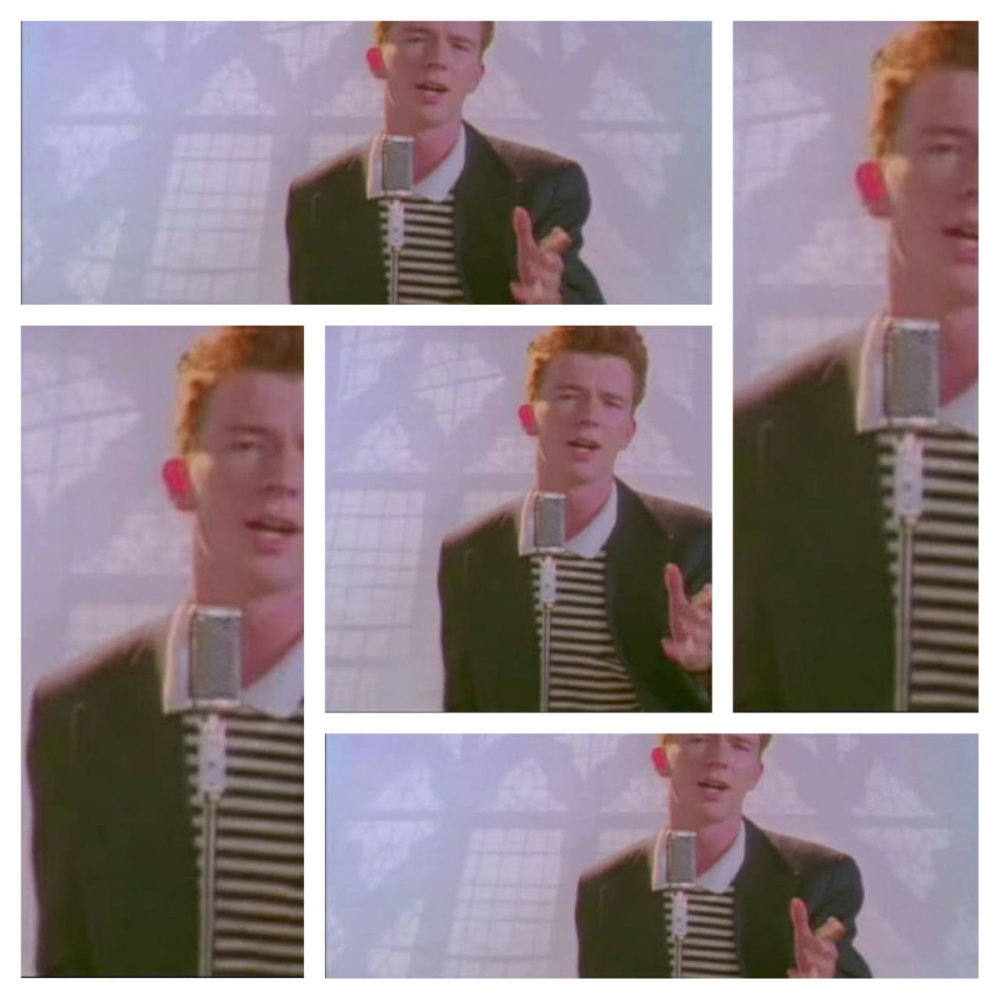

# Assignment-1- Personal Landing Page
<h4>In this assignment you will learn the basics of HTML and CSS. This will be an individual assignment and will require each one of you to submit their own file</h4>
<h3>General instructions:</h3>
<ol>
	<li>Use separate HTML and CSS files. Try to avoid using the style tag in the HTML file.</li>
	<li>We will look at your coding style also. So try to make the code as neat, clean, understandable and modular as possible.</li>
	<li>Since this is your first assignment, you are expected to make mistakes..(and improve later :p)</li>
	<li>The deadline for the assignment is 6th April 11:59 pm.</li>

</ol>
<h3>Assignment instructions:</h3>
Create a HTML page with your name as the title which includes atleast 4 sections(in a single page) :-
<ul>
	<li>About Me :- Name, Hobbies, Ambitions etc. </li>
	<li>Gallery :- This will contain 4 images and a video arranged like what is shown in the image below, note that do not add anchor link as it will direct the user to youtube. We want the video to play on the website itself.( The images can be anything, your pics, your fav anime, fav movies etc. depending on your creativity)  
	 
	</img>
	 
	 
	</li>
	<li>Form :- Add a query form with a submit button.Note that we don’t want a google form. The form should be made using HTML and CSS(no javascript). Add the fields (name, mail-id,etc.) in query form which you think are required. We do not want you to store the data. Submit button should refresh the entered fields.</li>
	<li>Contact Me :- This will be the footer section which will include your contact details and links to social media handles.</li>
	<li>Anything else you would like to see in your page.</li>
</ul>
<b> Try to add some more sections and bring in some creativity, afterall this is going to be your own personal website xD. 
<b> The first assignment is supposed to be your playing field, try to experiment with all the different tags and properties you have learnt, since the next assignment will be continuation of this webpage don't focus too much on the result</b>
<h3>Submissions instructions:</h3>
<ol>
	<li> Use this <a href="https://classroom.github.com/a/MdCTTnJM">link</a> to create the assignment repository
	<li> Clone the repo in your machine by using command "git clone (repo link)"
	<li> Push all changes to your copy of the assignment repo
	<li> <b> The deadline is 11:55 PM, 6 April, 2021 </b>
</ol>

### Note: We have not provided any boilerplate code as of now so that you can understand how each piece of HTML works, and figure out design choices for yourself. If you need boilerplate code please inform us.
